<h1>Hamze Ghalebi</h1>
<h3>Forward-Deployed AI Engineer · AI Systems Architect</h3>

<strong>I turn AI prototypes into reliable systems your team can use.</strong>

  Hands-on delivery of AI agents, document workflows and internal tools. 
  Connected to your data, integrated with your software, measured against a real business outcome.

  
  
  

Paris · Remote collaboration · English / French · Consulting &amp; embedded delivery

<a href="https://github.com/hghalebi/reliable-ai-agents">
  <picture>
    <source media="(prefers-reduced-motion: reduce)" srcset="assets/production-ai-static.svg" />
    
  </picture>
</a>

Architecture illustration, not live telemetry. <a href="assets/production-ai-static.svg">View the static version.</a>

---

## Where I can help

| What is blocking you? | What we work on |
| --- | --- |
| **The AI prototype works. It is not ready to ship.** | Build a production workflow around your agents, RAG or document processing: API and data integration, evaluation, access controls, human review and deployment. |
| **The AI system is unreliable, expensive or hard to debug.** | Diagnose failures. Add structured outputs, tracing, bounded retries, recovery and regression tests. Measure quality, latency and cost per completed task. |
| **You need someone to own delivery, not just recommend tools.** | Embed with your product and engineering team: scope the workflow, design the architecture, write the code, support rollout and hand over an operable system. |

**Start with one valuable workflow.** Agree on what success means, ship a narrow slice, and expand based on evidence. The deliverable is working software, evaluation evidence and an operational handover.

## Why I work this way

I am **CTO at [Remolab](https://remolab.fr/about)**. Previously, I led product and technology at **Welcome Account**, working on payments and AI-assisted KYC in a regulated environment.

That background shapes how I build: understand the user's job, integrate with the systems already in place, and make it clear what happens when something fails. I work with the team using the system, not only the team commissioning it.

## Public engineering work

**Start here: [Production AI Systems Architecture](https://hghalebi.github.io/production-ai-systems-architecture/)** — my book on evaluation, typed workflows, human oversight, observability, security and AI economics.

| Project | What you can inspect |
| --- | --- |
| [**Reliable AI Agents**](https://github.com/hghalebi/reliable-ai-agents) | Book and Rust / Rig / Postgres reference implementation covering durable jobs, explicit state, recovery and operational gates. |
| [**LLM Observability Guide**](https://github.com/hghalebi/rust-llm-observability-guide) | OpenTelemetry + SigNoz guide and examples for tracing model calls, tool execution and multi-agent workflows. |
| [**Typed LLM Boundaries**](https://github.com/hghalebi/Practical-tutorial-from-first-schema-to-reliable-LLM-boundaries) | Guide and examples for turning natural-language inputs into typed, validated data before downstream software acts on it. |
| [**fair-eval**](https://github.com/hghalebi/fair-eval) | Rust audit harness for testing output differences across otherwise equivalent hiring cases with controlled identity-linked cue changes. |
| [**Agentic Workstation**](https://github.com/hghalebi/agentic-workstation) | Repeatable Ubuntu environments for coding agents, with profiles, health checks, a Rust planning CLI and Nix-based validation. |

These are books, reference implementations and tools, not a list of client deployments. Each repository has its own scope and license.

## Currently building

**[Dayeh](https://dayeh.io/)** — an early-stage, proactive AI parenting companion. Building context-aware support and learning which behaviours genuinely help parents. TypeScript + Mastra.

**Agent delivery infrastructure** — developing a Rust CI/CD optimizer around bounded coding-agent changes, verification gates and recoverable deployments. The focus: making agent-assisted engineering repeatable, not just fast once.

<strong>Stack &amp; engineering approach</strong>

 

| Layer | Tools and practices |
| --- | --- |
| **Application &amp; agents** | Rust · TypeScript · Python · Rig · Mastra · RAG · Tool calling · Structured outputs |
| **Backend &amp; state** | Axum · Tokio · PostgreSQL · Background workers · Idempotency · Durable jobs |
| **Operations** | OpenTelemetry · SigNoz · Sentry · Docker · NixOS · GitHub Actions |
| **Controls** | Evaluation suites · Scoped permissions · Human review · Audit events · Recovery paths |

Rust is a strong part of my toolkit, not a requirement for your project. I work with the stack your product and team need.

<strong>Teaching &amp; learning in public</strong>

 

[**Agentic Rust: Core Labs 101**](https://github.com/hghalebi/agentic-rust-core-labs-101) — hands-on labs covering tools, policies, memory, RAG and durable agent runs.

[**AI Reading Club**](https://github.com/hghalebi/ai-reading-club) — foundational AI papers and the engineering questions behind them.

[**rust-ml.com**](https://rust-ml.com/) · [**Category Theory for Tiny ML in Rust**](https://github.com/hghalebi/category_theory_transformer_rs) — learning machine learning through small, inspectable systems.

---

## Have a workflow that should work better?

Send me **what happens today, what is blocked, and what a useful result would look like**. Add your timeline. No pitch deck required.

**[Discuss a project by email](mailto:hg@remolab.fr?subject=AI%20engineering%20project)** · **[Message me on LinkedIn](https://www.linkedin.com/in/hamze/)**

The model can be probabilistic. The system still needs clear responsibilities.
